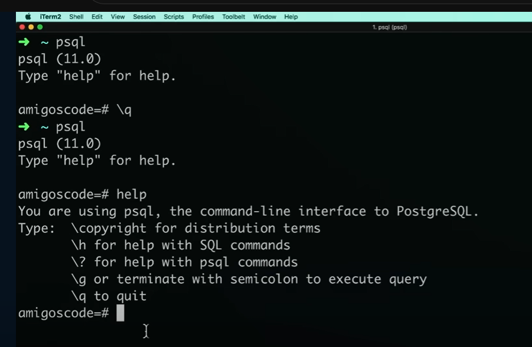
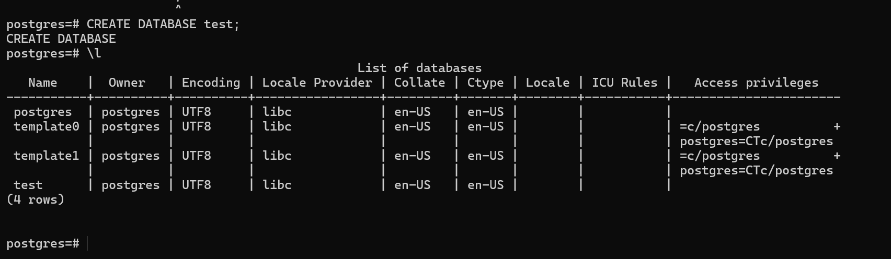

# How to Create and Connect to a DataBase.

## Creating a DataBase

- quit command - `/q`

In SQL Shell, if you created a local database, quit out of it. `/q`

Then type `psql`, it will take you to a mode that you will see you are using psql, its version and how to find help. 

When you type `help` you are going to get some help.

- You will notice that most of the commands start with a back-slash `\`.

- To get more help, type `\?`.

- `\l` lists all the databases that we have.

To create a fresh database, we use the command `CREATE DATABASE`, you can use any case, but uppercase if the best database way.

- then give it a name, and end it with a semi-colon, otherwise it wont execute the command.

> CREATE DATABASE test;

When you view the list of all databases, `\l`, you will see the database that we have created.

## Connecting to a Database

