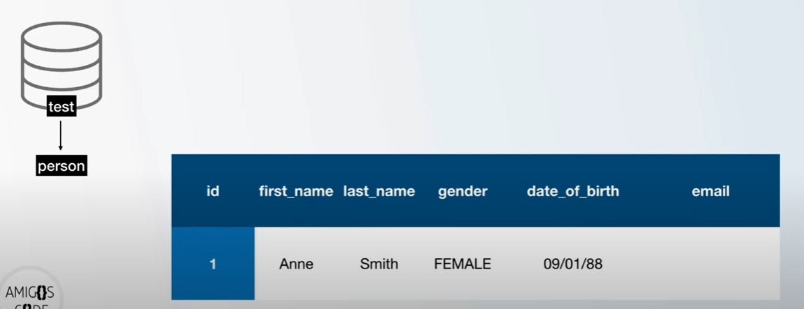
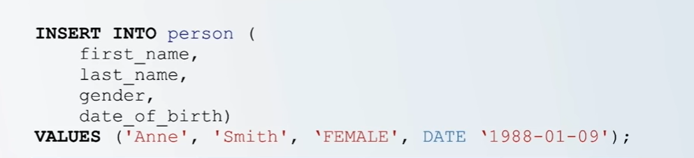
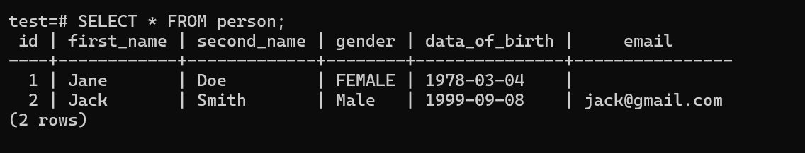

# How to Insert Records Into Tables 



We currently have a database called test, with a table called person. 

The table has a column of `id, first_name, gender, data_of_birth and email.`

Lets say we want to insert a new person into this table. 
- The person will have an ID of 1, names: Anne Smith, a date of birth but no email. 




- We use the Command:

> INSERT INTO actual_table_name

> INSERT INTO person

Then specify the columns that we want to insert. 

Since the person does not have an `email`, we dont have to specify the email column. 

Then we have to say: `VALUES`.

- Values takes a list of values matching the column data-types.
- In date, year comes first, then month then day.

That is how we insert records into a table. 

When we want to insert the second person, it is still the same process. 

If the person has an email, we also specify the email. 

- Note that we are not specifying the `id` column. `BIGSERIAL` data type does an auto increment for us. 

Lets do it practically: 

```
test=# INSERT INTO person (first_name, second_name, gender, data_of_birth)

test-# VALUES('Jane', 'Doe', 'FEMALE', date '1978-3-4');

INSERT 0 1
```

To view the inserted data, use:

> SELECT * FROM actual_table_name;

> SELECT * FROM person;




