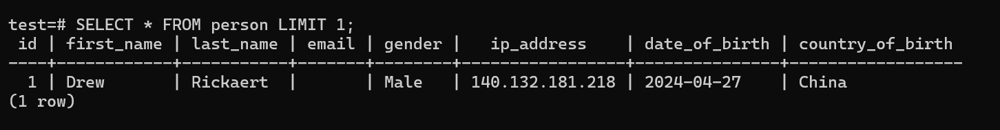
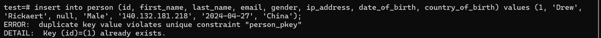
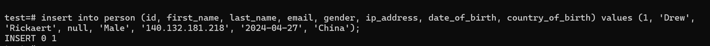
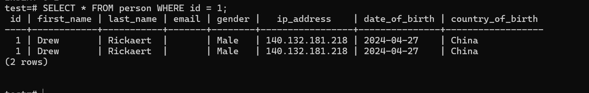

# Primary Keys

Lets say we have a table with 2 people whose columns have exact values apart from the email.

The emails are almost same apart from the actual domain.


How would we uniquely identify each row?

- This is where primary keys come into play.

For instance, we can use a passport number guaranteed to be unique to identify each one.

### Primary key is a value in our column that uniquely identifies a person/object in the table.

What we are currently using as primary key are numbers (1, 2, 3...), managing it with a sequence.

However, we can use a different data type for our `column ID`

- At this point, `BIGSERIAL` data type is fine.

# Understanding Primary Keys

Lets go ahead and understand how to work with primary keys.

- lets describe our `person` table.
- You will see the `id` is what uniquely identifies a person.
  `PRIMARY KEY`.

When we create a table, this ` "person_pkey" PRIMARY KEY, btree (id)` is already given.

The id is auto incremented by itself: ` nextval('person_id_seq'::regclass)`

Lets first select a limit of one person.

```sql
SELECT * FROM person LIMIT 1;
```



- We will have a person with an ID of 1.
- If we try to insert another person in the table with an ID of 1, it will not work since a primary key cannot be duplicated.



Basically 2 people cannot share the same id.

- Lets try and drop the primary key constraint by altering the table and dropping the actual constraint.

```sql
test=# ALTER TABLE person DROP CONSTRAINT person_pkey;
```

Now when we describe our table, there will be no primary key.

Now when I try to insert the same person, it will now work.



Now when we select all from person where the id is 1.
We will have a list of 2 people. With exact same `id` and other details.



It will be impossible to uniquely identify this people, because they have the same `id`.

- It is therefore important to have an ID as a primary key.

Unique values help identify a record in a table.

# Adding Primary Key

Lets add the primary key back.

- When we dropped the constraint/primary key, we simply said `ALTER TABLE person DROP CONSTRAINT actual_constraint_name`.

- Primary key receives an array of values since it can be composed based on multiple columns.

- For us, we just need the id.

- Now to add a primary key, we say `ALTER TABLE person ADD PRIMARY KEY(id) `

However, this

```
ALTER TABLE person ADD PRIMARY KEY(id);
```

will not work.

```

test=# ALTER TABLE person ADD PRIMARY KEY(id);
ERROR:  could not create unique index "person_pkey"
DETAIL:  Key (id)=(1) is duplicated.
```

The reason is, we cannot add a primary key when the rows are not unique in our table.

When we

> SELECT \* FROM person WHERE id = 1;

We will see two people with the same ID.

To deal with this, we need to delete the 2 people.

### How to delete from a table.

```sql
 DELETE FROM person WHERE id = 1;
```

Since we have 2 people with the same `id`, it will delete the 2 rows.

Now if we select where ID is equal to 1, we wil have 0 rows.

```sql
test=# SELECT * FROM person WHERE id = 1;
```

Now we are sure that the id column should be unique in our table.

Lets go ahead and add the person whose `id` was 1.

- Now lets add the primary key constraint.

```sql
test=# ALTER TABLE person ADD PRIMARY KEY (id);

ALTER TABLE
```

This time it is going to work. Because the id's are now unique in the table.

When we now describe the table,

> \d person

We should now see our primary key.

- If you want to add a primary key, make sure the column that you want to be the primary key is unique in every single row.
