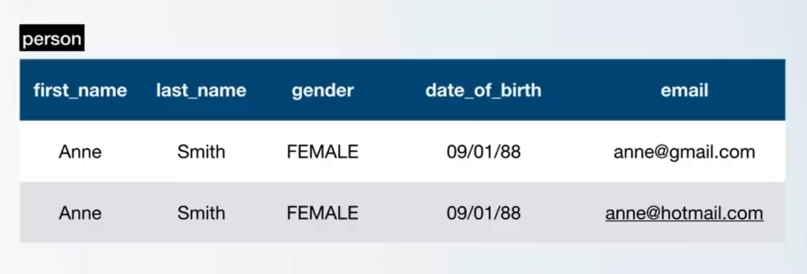

# Primary Keys

Lets say we have a table with 2 people whose columns have exact values apart from the email.

The emails are almost same apart from the actual domain.



How would we uniquely identify each row?

- This is where primary keys come into play.

For instance, we can use a passport number guaranteed to be unique to identify each one.

### Primary key is a value in our column that uniquely identifies a person/object in the table.

What we are currently using as primary key are numbers (1, 2, 3...), managing it with a sequence.

However, we can use a different data type for our `column ID`

- At this point, `BIGSERIAL` data type is fine.

# Understanding Primary Keys

Lets go ahead and understand how to work with primary keys.

- lets describe our `person` table.
- You will see the `id` is what uniquely identifies a person.
  `PRIMARY KEY`.

When we create a table, this ` "person_pkey" PRIMARY KEY, btree (id)` is already given.

The id is auto incremented by itself: ` nextval('person_id_seq'::regclass)`

Lets first select a limit of one person.

```sql
SELECT * FROM person LIMIT 1;
```


- We will have a person with an ID of 1.
- If we try to insert another person in the table with an ID of 1, it will not work since a primary key cannot be duplicated.


Basically 2 people cannot share the same id.

- Lets try and drop the primary key constraint by altering the table and dropping the actual constraint.

```sql
test=# ALTER TABLE person DROP CONSTRAINT person_pkey;
```

Now when we describe our table, there will be no primary key.
